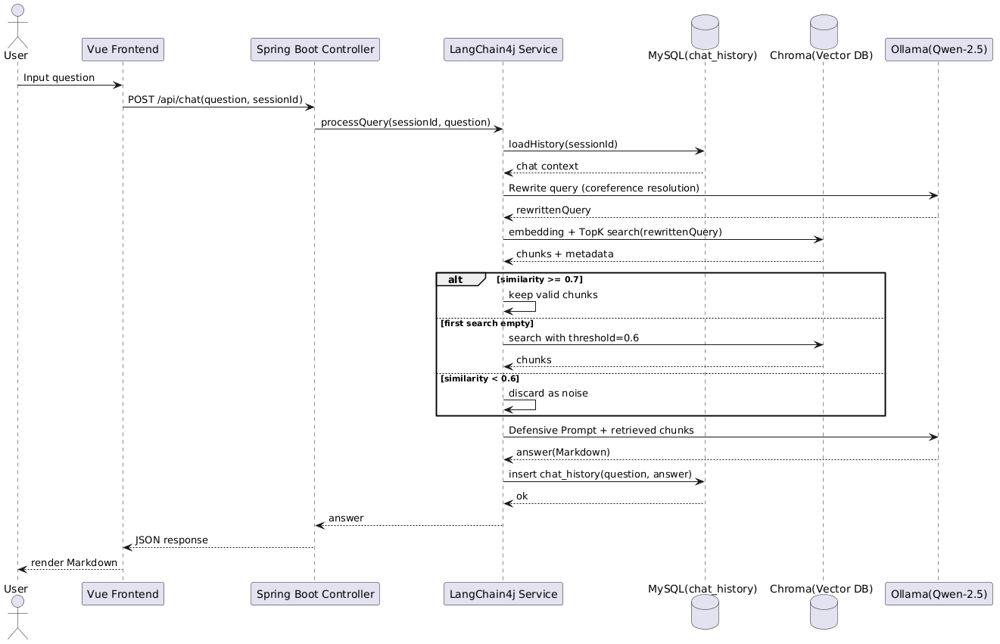
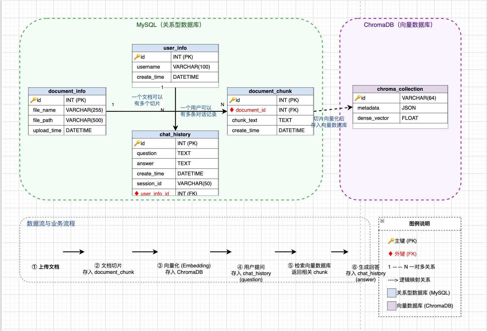

# Enterprise RAG Q&A System

基于本地大模型 + RAG 的企业知识库问答系统，所有数据不出本机。

技术栈：Vue 3 / Spring Boot / LangChain4j / Ollama / Qwen2.5 / ChromaDB / MySQL

---

## 这个项目做什么

上传 PDF 或 Word 文档后，系统自动把文档切块、向量化，存到 ChromaDB。提问时先从知识库检索相关段落，再交给本地 Qwen2.5 模型生成回答，回答末尾会标注参考了哪个文件。

整个过程不调用任何外部 API，模型跑在你自己机器上，企业内部文档不会泄露。

跟直接把文档丢给 ChatGPT 比，这个系统多了两件事：
- **检索不到就不答** — 余弦相似度低于阈值直接拒绝回答，不会瞎编
- **多轮对话能记住上下文** — 你说"它里面第二点是什么"，系统知道"它"指的是上一轮聊的文档

## 界面预览



左边栏是多会话切换，右边是聊天区域。上传文档后可以直接提问，回答末尾会标注参考了哪个文件。



上半部分问了知识库以外的问题，系统直接拒绝回答；下半部分问了知识库内的问题，回答末尾带了参考文件来源。

## 架构

```
浏览器 (Vue 3)
    │  :5173
    ▼
Spring Boot (:8080) ── LangChain4j 编排
    │
    ├── Ollama (:11434)  ── Qwen2.5:7b 本地推理
    ├── FastAPI (:8001)  ── BGE-base-zh 文本向量化
    ├── ChromaDB (:8000) ── 向量存储
    └── MySQL (:3306)    ── 会话历史、文档记录
```

五个服务要分别启动。装了 Docker 的话，MySQL、ChromaDB、嵌入服务这三个一条命令起：

```bash
docker compose up -d
```

然后只需要手动起 Ollama、后端、前端。下面步骤里标了"（Docker 模式可跳过）"的就不用管。

## 环境要求

- JDK 17（Spring Boot 3.x 必须 17+）
- Node.js 18+
- Ollama
- Docker（可选，推荐，用来一键起 MySQL + ChromaDB + 嵌入服务）
- 不用 Docker 的话需要本地装 MySQL 8.0+ 和 Python 3.10+

内存建议 16GB 以上，Qwen2.5-7B 量化后大概占 5GB 内存。

## 部署步骤

### 第 1 步：装 Ollama 并拉模型

去 [ollama.com](https://ollama.com) 下载安装包，装好后终端里执行：

```bash
ollama pull qwen2.5:7b
```

这会下载一个 4.7GB 的量化模型。下完后验证一下：

```bash
ollama list
# 应该看到 qwen2.5:latest，SIZE 约 4.7 GB
```

Ollama 装完会自动在后台跑，监听 `localhost:11434`。不用手动 `ollama serve`。

> 如果机器内存紧张，可以换成 `qwen2.5:3b`，内存占用更小，效果差一点但够 demo 用。换的话记得改 `RagService.java` 里的 modelName。

### 第 2 步：启动基础设施（MySQL + ChromaDB + 嵌入服务）

**用 Docker（推荐）**：

```bash
docker compose up -d
```

这会自动起三个容器：MySQL（密码 `rag123456`）、ChromaDB、Python 嵌入服务。首次启动嵌入服务会自动下载 bge-base-zh 模型（约 400MB），要等几分钟。

启动完跳到第 4 步，application.yml 里密码改成 `rag123456`。

**不用 Docker 的话**，手动起三个：

ChromaDB：
```bash
docker run -d -p 8000:8000 chromadb/chroma
# 或 pip install chromadb && chroma run --path ./chroma_data --port 8000
```

Python 嵌入服务：
```bash
python3 -m venv venv
source venv/bin/activate    # Windows: venv\Scripts\activate
pip install -r embedding-requirements.txt
uvicorn embed_server:app --host 0.0.0.0 --port 8001
```

MySQL 本地装完后建库建表（见第 4 步的 SQL）。

### 第 3 步：建 MySQL 数据库

如果用 Docker 起的 MySQL，库和表已经自动建好了，密码是 `rag123456`。跳到第 4 步。

手动装 MySQL 的话，登录执行：

```sql
CREATE DATABASE IF NOT EXISTS ai_rag_db DEFAULT CHARACTER SET utf8mb4;

USE ai_rag_db;

CREATE TABLE document_info (
    id INT PRIMARY KEY AUTO_INCREMENT,
    file_name VARCHAR(255),
    file_path VARCHAR(500),
    upload_time DATETIME DEFAULT CURRENT_TIMESTAMP
);

CREATE TABLE chat_history (
    id INT PRIMARY KEY AUTO_INCREMENT,
    question TEXT,
    answer TEXT,
    session_id VARCHAR(50),
    create_time DATETIME DEFAULT CURRENT_TIMESTAMP,
    INDEX idx_session (session_id)
);
```

### 第 4 步：改数据库密码

编辑 `java_RAGService/ai-largedemo/src/main/resources/application.yml`：

```yaml
spring:
  datasource:
    url: jdbc:mysql://localhost:3306/ai_rag_db?useUnicode=true&characterEncoding=utf8&serverTimezone=Asia/Shanghai
    username: root
    password: rag123456    # Docker compose 模式用这个，本地安装改成你自己的密码
```

### 第 5 步：启动 Spring Boot 后端

```bash
cd java_RAGService/ai-largedemo
mvn spring-boot:run
```

启动成功后跑在 `localhost:8080`。第一次跑 Maven 会下载依赖，要等几分钟。

### 第 6 步：启动前端

回到项目根目录：

```bash
npm install
npm run dev
```

浏览器打开 `http://localhost:5173`，左边栏点"新对话"就能开始聊了。点旁边的上传按钮传个 PDF 或 Word 文档，等提示"上传成功"后再提问。

### 服务端口汇总

| 服务 | 端口 | Docker compose | 手动启动 |
|------|------|----------------|----------|
| 前端 Vite | 5173 | — | `npm run dev` |
| Spring Boot | 8080 | — | `mvn spring-boot:run` |
| Python 嵌入服务 | 8001 | ✅ | `uvicorn embed_server:app --port 8001` |
| ChromaDB | 8000 | ✅ | `docker run -p 8000:8000 chromadb/chroma` |
| Ollama | 11434 | — | 装完自动跑 |
| MySQL | 3306 | ✅ | 本地安装，密码 `rag123456` |

## API 说明

后端起好后有三个接口：

**上传文档**
```
POST http://localhost:8080/api/rag/upload
Content-Type: multipart/form-data
参数: file=@你的文件.pdf
```

**提问**
```
GET http://localhost:8080/api/rag/ask?sessionId=abc123&question=这个文档讲了什么
```

`sessionId` 不传的话默认用 `default`，传不同的 id 就是不同的会话，互相不串。

**历史记录**
```
GET http://localhost:8080/api/rag/history
```

## 几个关键设计点

**切块策略** — 文档切成 500 字符一块，块之间重叠 100 字符。直接一刀切长文会把表格、段落从中间切断，重叠 100 字能保住上下文连贯。

**防幻觉** — 分三步：
1. 先把你的问题结合历史对话重写一遍（解决"它、这个"这类指代）
2. 去 Chroma 检索，余弦相似度 ≥ 0.7 才认作相关，不够就自动降到 0.6 再试一次
3. 两次都不够就直接返回"知识库中没有相关信息"，不让模型自由发挥

**会话隔离** — 每个对话一个 sessionId，聊历史存在内存 ConcurrentHashMap 里，同时写一份到 MySQL。刷新页面历史记录不会丢。

## 项目结构

```
├── index.html
├── vite.config.js            # 配了 /api 代理到 8080
├── package.json
├── style.css
├── src/
│   ├── main.js
│   ├── App.vue
│   └── components/
│       └── ChatPage.vue      # 聊天主界面
├── embed_server.py           # Python 向量嵌入服务
├── rag_demo.py               # 纯 Python 的 RAG 最小 demo
├── embedding-requirements.txt
├── docker-compose.yml        # 一键起 MySQL + ChromaDB + 嵌入服务
├── Dockerfile.embedding
└── java_RAGService/
    └── ai-largedemo/         # Spring Boot 后端
        ├── pom.xml
        └── src/main/
            ├── java/com/example/ailargedemo/
            │   ├── controller/RagController.java
            │   ├── service/RagService.java
            │   ├── entity/
            │   └── mapper/
            └── resources/application.yml
```

## License

MIT

---

如果这个项目对你有帮助，点个 Star ⭐
